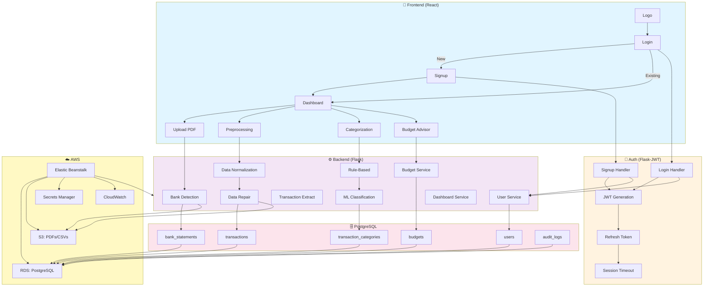
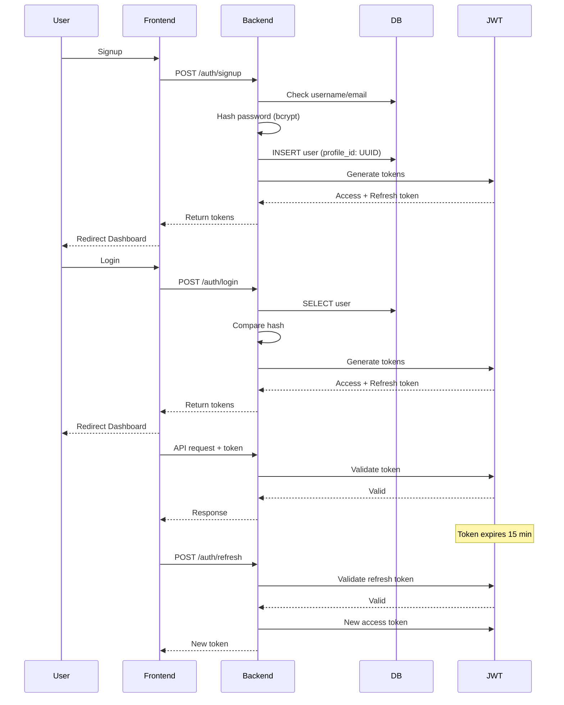
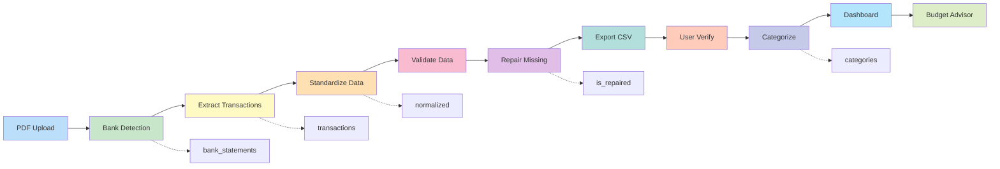
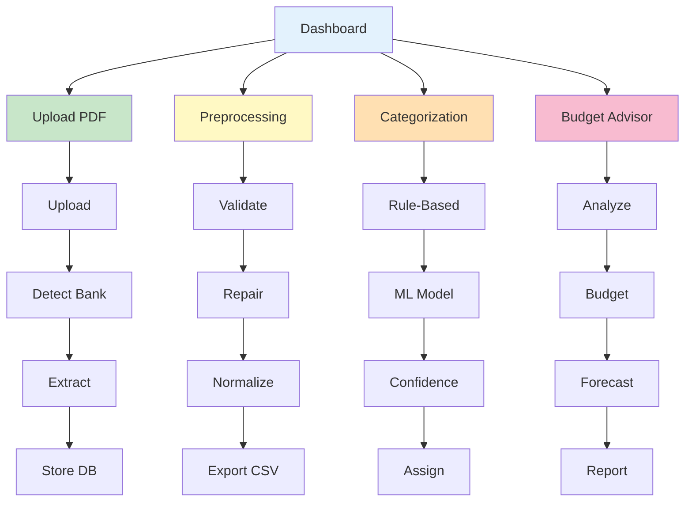
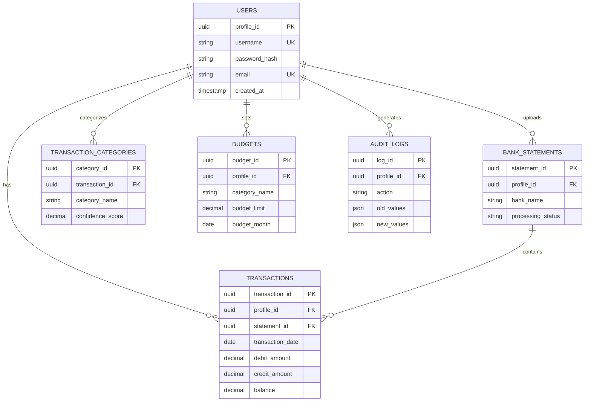
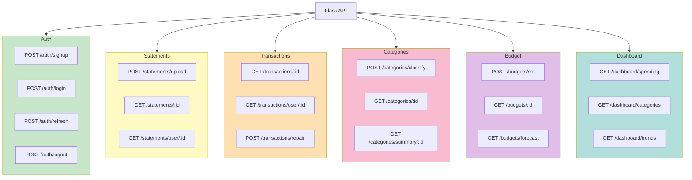
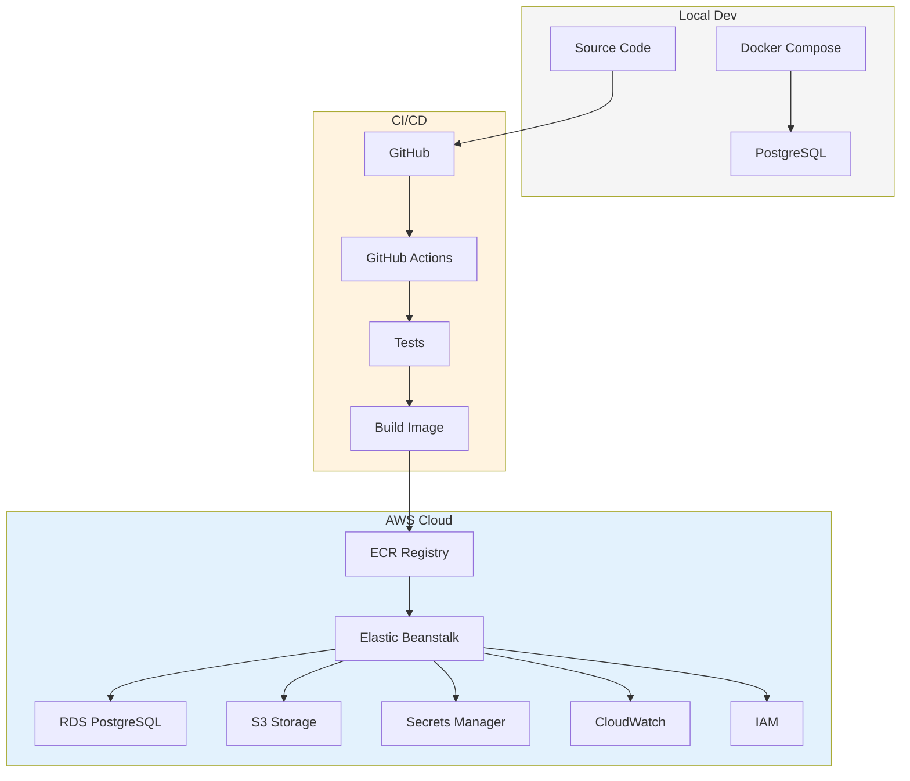

```mermaid
graph TB
    subgraph Frontend["🎨 Frontend (React)"]
        Logo["Logo"]
        Login["Login"]
        Signup["Signup"]
        Dashboard["Dashboard"]
        UploadPDF["Upload PDF"]
        Preprocessing["Preprocessing"]
        Category["Categorization"]
        BudgetAdvisor["Budget Advisor"]
    end

    subgraph Auth["🔐 Auth (Flask-JWT)"]
        SignupHandler["Signup Handler"]
        LoginHandler["Login Handler"]
        TokenGen["JWT Generation"]
        TokenRefresh["Refresh Token"]
        SessionTimeout["Session Timeout"]
    end

    subgraph Backend["⚙️ Backend (Flask)"]
        UserService["User Service"]
        BankDetection["Bank Detection"]
        TransactionExtraction["Transaction Extract"]
        DataNormalization["Data Normalization"]
        DataRepair["Data Repair"]
        RuleBasedCategorization["Rule-Based"]
        MLCategorization["ML Classification"]
        DashboardService["Dashboard Service"]
        BudgetService["Budget Service"]
    end

    subgraph Database["🗄️ PostgreSQL"]
        UsersTable["users"]
        BankStatementsTable["bank_statements"]
        TransactionsTable["transactions"]
        CategoriesTable["transaction_categories"]
        BudgetsTable["budgets"]
        AuditLogsTable["audit_logs"]
    end

    subgraph AWS["☁️ AWS"]
        S3["S3: PDFs/CSVs"]
        RDS["RDS: PostgreSQL"]
        SecretsManager["Secrets Manager"]
        CloudWatch["CloudWatch"]
        EB["Elastic Beanstalk"]
    end

    Logo --> Login
    Login -->|New| Signup
    Login -->|Existing| Dashboard
    Signup --> Dashboard
    
    Signup --> SignupHandler
    Login --> LoginHandler
    SignupHandler --> TokenGen
    LoginHandler --> TokenGen
    TokenGen --> TokenRefresh
    TokenRefresh --> SessionTimeout
    
    Dashboard --> UploadPDF
    Dashboard --> Preprocessing
    Dashboard --> Category
    Dashboard --> BudgetAdvisor
    
    SignupHandler --> UserService
    LoginHandler --> UserService
    UserService --> UsersTable
    
    UploadPDF --> BankDetection
    BankDetection --> BankStatementsTable
    BankDetection --> S3
    
    Preprocessing --> DataNormalization
    DataNormalization --> DataRepair
    DataRepair --> TransactionsTable
    DataRepair --> S3
    
    Category --> RuleBasedCategorization
    RuleBasedCategorization --> MLCategorization
    MLCategorization --> CategoriesTable
    
    BudgetAdvisor --> BudgetService
    BudgetService --> BudgetsTable
    
    UsersTable --> RDS
    BankStatementsTable --> RDS
    TransactionsTable --> RDS
    CategoriesTable --> RDS
    BudgetsTable --> RDS
    AuditLogsTable --> RDS
    
    EB --> Backend
    EB --> RDS
    EB --> S3
    EB --> SecretsManager
    EB --> CloudWatch
    
    style Frontend fill:#e1f5ff
    style Auth fill:#fff3e0
    style Backend fill:#f3e5f5
    style Database fill:#fce4ec
    style AWS fill:#fff9c4
```

```mermaid
sequenceDiagram
    participant User
    participant Frontend
    participant Backend
    participant DB
    participant JWT

    User->>Frontend: Signup
    Frontend->>Backend: POST /auth/signup
    Backend->>DB: Check username/email
    Backend->>Backend: Hash password (bcrypt)
    Backend->>DB: INSERT user (profile_id: UUID)
    Backend->>JWT: Generate tokens
    JWT-->>Backend: Access + Refresh token
    Backend-->>Frontend: Return tokens
    Frontend-->>User: Redirect Dashboard

    User->>Frontend: Login
    Frontend->>Backend: POST /auth/login
    Backend->>DB: SELECT user
    Backend->>Backend: Compare hash
    Backend->>JWT: Generate tokens
    JWT-->>Backend: Access + Refresh token
    Backend-->>Frontend: Return tokens
    Frontend-->>User: Redirect Dashboard

    Frontend->>Backend: API request + token
    Backend->>JWT: Validate token
    JWT-->>Backend: Valid
    Backend-->>Frontend: Response

    Note over JWT: Token expires 15 min
    Frontend->>Backend: POST /auth/refresh
    Backend->>JWT: Validate refresh token
    JWT-->>Backend: Valid
    Backend->>JWT: New access token
    Backend-->>Frontend: New token
```

```mermaid
graph LR
    A["PDF Upload"] --> B["Bank Detection"]
    B --> C["Extract Transactions"]
    C --> D["Standardize Data"]
    D --> E["Validate Data"]
    E --> F["Repair Missing"]
    F --> G["Export CSV"]
    G --> H["User Verify"]
    H --> I["Categorize"]
    I --> J["Dashboard"]
    J --> K["Budget Advisor"]
    
    B -.-> DB1["bank_statements"]
    C -.-> DB2["transactions"]
    D -.-> DB3["normalized"]
    F -.-> DB4["is_repaired"]
    I -.-> DB5["categories"]
    
    style A fill:#bbdefb
    style B fill:#c8e6c9
    style C fill:#fff9c4
    style D fill:#ffe0b2
    style E fill:#f8bbd0
    style F fill:#e1bee7
    style G fill:#b2dfdb
    style H fill:#ffccbc
    style I fill:#c5cae9
    style J fill:#b3e5fc
    style K fill:#dcedc8
```

```mermaid
graph TB
    Dashboard["Dashboard"]
    
    Dashboard --> Box1["Upload PDF"]
    Dashboard --> Box2["Preprocessing"]
    Dashboard --> Box3["Categorization"]
    Dashboard --> Box4["Budget Advisor"]
    
    Box1 --> U1["Upload"]
    U1 --> U2["Detect Bank"]
    U2 --> U3["Extract"]
    U3 --> U4["Store DB"]
    
    Box2 --> P1["Validate"]
    P1 --> P2["Repair"]
    P2 --> P3["Normalize"]
    P3 --> P4["Export CSV"]
    
    Box3 --> C1["Rule-Based"]
    C1 --> C2["ML Model"]
    C2 --> C3["Confidence"]
    C3 --> C4["Assign"]
    
    Box4 --> B1["Analyze"]
    B1 --> B2["Budget"]
    B2 --> B3["Forecast"]
    B3 --> B4["Report"]
    
    style Dashboard fill:#e3f2fd
    style Box1 fill:#c8e6c9
    style Box2 fill:#fff9c4
    style Box3 fill:#ffe0b2
    style Box4 fill:#f8bbd0
```

```mermaid
erDiagram
    USERS ||--o{ BANK_STATEMENTS : uploads
    USERS ||--o{ TRANSACTIONS : has
    USERS ||--o{ TRANSACTION_CATEGORIES : categorizes
    USERS ||--o{ BUDGETS : sets
    USERS ||--o{ AUDIT_LOGS : generates
    BANK_STATEMENTS ||--o{ TRANSACTIONS : contains

    USERS {
        uuid profile_id PK
        string username UK
        string password_hash
        string email UK
        timestamp created_at
    }

    BANK_STATEMENTS {
        uuid statement_id PK
        uuid profile_id FK
        string bank_name
        string processing_status
    }

    TRANSACTIONS {
        uuid transaction_id PK
        uuid profile_id FK
        uuid statement_id FK
        date transaction_date
        decimal debit_amount
        decimal credit_amount
        decimal balance
    }

    TRANSACTION_CATEGORIES {
        uuid category_id PK
        uuid transaction_id FK
        string category_name
        decimal confidence_score
    }

    BUDGETS {
        uuid budget_id PK
        uuid profile_id FK
        string category_name
        decimal budget_limit
        date budget_month
    }

    AUDIT_LOGS {
        uuid log_id PK
        uuid profile_id FK
        string action
        json old_values
        json new_values
    }
```

```mermaid
graph TB
    API["Flask API"]
    
    subgraph Auth["Auth"]
        POST1["POST /auth/signup"]
        POST2["POST /auth/login"]
        POST3["POST /auth/refresh"]
        POST4["POST /auth/logout"]
    end
    
    subgraph Stmt["Statements"]
        POST5["POST /statements/upload"]
        GET1["GET /statements/:id"]
        GET2["GET /statements/user/:id"]
    end
    
    subgraph Txn["Transactions"]
        GET3["GET /transactions/:id"]
        GET4["GET /transactions/user/:id"]
        POST6["POST /transactions/repair"]
    end
    
    subgraph Cat["Categories"]
        POST7["POST /categories/classify"]
        GET5["GET /categories/:id"]
        GET6["GET /categories/summary/:id"]
    end
    
    subgraph Bud["Budget"]
        POST8["POST /budgets/set"]
        GET7["GET /budgets/:id"]
        GET8["GET /budgets/forecast"]
    end
    
    subgraph Dash["Dashboard"]
        GET9["GET /dashboard/spending"]
        GET10["GET /dashboard/categories"]
        GET11["GET /dashboard/trends"]
    end
    
    API --> Auth
    API --> Stmt
    API --> Txn
    API --> Cat
    API --> Bud
    API --> Dash
    
    style API fill:#e8eaf6
    style Auth fill:#c8e6c9
    style Stmt fill:#fff9c4
    style Txn fill:#ffe0b2
    style Cat fill:#f8bbd0
    style Bud fill:#e1bee7
    style Dash fill:#b2dfdb
```

```mermaid
graph TB
    subgraph Local["Local Dev"]
        Code["Source Code"]
        Docker["Docker Compose"]
        LocalDB["PostgreSQL"]
    end
    
    subgraph CI["CI/CD"]
        GitHub["GitHub"]
        Actions["GitHub Actions"]
        Tests["Tests"]
        Build["Build Image"]
    end
    
    subgraph AWS["AWS Cloud"]
        ECR["ECR Registry"]
        EB["Elastic Beanstalk"]
        RDS["RDS PostgreSQL"]
        S3["S3 Storage"]
        SM["Secrets Manager"]
        CW["CloudWatch"]
        IAM["IAM"]
    end
    
    Code --> GitHub
    GitHub --> Actions
    Actions --> Tests
    Tests --> Build
    Build --> ECR
    ECR --> EB
    EB --> RDS
    EB --> S3
    EB --> SM
    EB --> CW
    EB --> IAM
    
    Docker --> LocalDB
    
    style Local fill:#f5f5f5
    style CI fill:#fff3e0
    style AWS fill:#e3f2fd
```
