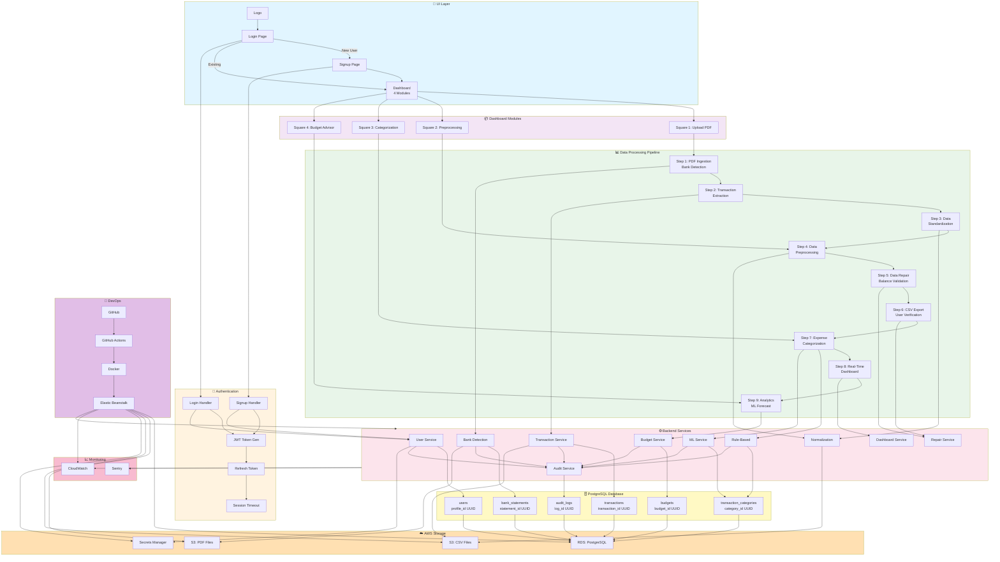

```mermaid
graph TB
    subgraph UI["🎨 UI Layer"]
        Logo["Logo"]
        Login["Login Page"]
        Signup["Signup Page"]
        Dashboard["Dashboard<br/>4 Modules"]
    end

    subgraph Auth["🔐 Authentication"]
        SignupH["Signup Handler"]
        LoginH["Login Handler"]
        JWT["JWT Token Gen"]
        Refresh["Refresh Token"]
        Timeout["Session Timeout"]
    end

    subgraph Modules["📦 Dashboard Modules"]
        M1["Square 1: Upload PDF"]
        M2["Square 2: Preprocessing"]
        M3["Square 3: Categorization"]
        M4["Square 4: Budget Advisor"]
    end

    subgraph Pipeline["📊 Data Processing Pipeline"]
        P1["Step 1: PDF Ingestion<br/>Bank Detection"]
        P2["Step 2: Transaction<br/>Extraction"]
        P3["Step 3: Data<br/>Standardization"]
        P4["Step 4: Data<br/>Preprocessing"]
        P5["Step 5: Data Repair<br/>Balance Validation"]
        P6["Step 6: CSV Export<br/>User Verification"]
        P7["Step 7: Expense<br/>Categorization"]
        P8["Step 8: Real-Time<br/>Dashboard"]
        P9["Step 9: Analytics<br/>ML Forecast"]
    end

    subgraph Services["⚙️ Backend Services"]
        UserSvc["User Service"]
        BankSvc["Bank Detection"]
        TxnSvc["Transaction Service"]
        NormSvc["Normalization"]
        RepairSvc["Repair Service"]
        RuleSvc["Rule-Based"]
        MLSvc["ML Service"]
        DashSvc["Dashboard Service"]
        BudgetSvc["Budget Service"]
        AuditSvc["Audit Service"]
    end

    subgraph DB["🗄️ PostgreSQL Database"]
        Users["users<br/>profile_id UUID"]
        Stmts["bank_statements<br/>statement_id UUID"]
        Txns["transactions<br/>transaction_id UUID"]
        Cats["transaction_categories<br/>category_id UUID"]
        Budgets["budgets<br/>budget_id UUID"]
        Audit["audit_logs<br/>log_id UUID"]
    end

    subgraph Storage["☁️ AWS Storage"]
        S3PDF["S3: PDF Files"]
        S3CSV["S3: CSV Files"]
        RDS["RDS: PostgreSQL"]
        SM["Secrets Manager"]
    end

    subgraph Monitoring["📈 Monitoring"]
        CW["CloudWatch"]
        Sentry["Sentry"]
    end

    subgraph DevOps["🚀 DevOps"]
        GH["GitHub"]
        GHA["GitHub Actions"]
        Docker["Docker"]
        EB["Elastic Beanstalk"]
    end

    %% UI Flow
    Logo --> Login
    Login -->|New User| Signup
    Login -->|Existing| Dashboard
    Signup --> Dashboard

    %% Auth Flow
    Signup --> SignupH
    Login --> LoginH
    SignupH --> JWT
    LoginH --> JWT
    JWT --> Refresh
    Refresh --> Timeout

    %% Dashboard to Modules
    Dashboard --> M1
    Dashboard --> M2
    Dashboard --> M3
    Dashboard --> M4

    %% Modules to Pipeline
    M1 --> P1
    M2 --> P4
    M3 --> P7
    M4 --> P9

    %% Pipeline Flow
    P1 --> P2
    P2 --> P3
    P3 --> P4
    P4 --> P5
    P5 --> P6
    P6 --> P7
    P7 --> P8
    P8 --> P9

    %% Pipeline to Services
    P1 --> BankSvc
    P2 --> TxnSvc
    P3 --> NormSvc
    P4 --> NormSvc
    P5 --> RepairSvc
    P6 --> RepairSvc
    P7 --> RuleSvc
    P7 --> MLSvc
    P8 --> DashSvc
    P9 --> BudgetSvc

    %% Auth to Services
    SignupH --> UserSvc
    LoginH --> UserSvc

    %% Services to Database
    UserSvc --> Users
    BankSvc --> Stmts
    TxnSvc --> Txns
    RuleSvc --> Cats
    MLSvc --> Cats
    BudgetSvc --> Budgets
    AuditSvc --> Audit

    %% Services to Audit
    UserSvc --> AuditSvc
    BankSvc --> AuditSvc
    TxnSvc --> AuditSvc
    RuleSvc --> AuditSvc
    MLSvc --> AuditSvc
    BudgetSvc --> AuditSvc

    %% Database to Storage
    Users --> RDS
    Stmts --> RDS
    Txns --> RDS
    Cats --> RDS
    Budgets --> RDS
    Audit --> RDS

    %% Services to Storage
    BankSvc --> S3PDF
    NormSvc --> S3CSV
    TxnSvc --> S3CSV
    UserSvc --> SM

    %% Monitoring
    Services --> CW
    Services --> Sentry

    %% DevOps
    GH --> GHA
    GHA --> Docker
    Docker --> EB
    EB --> Services
    EB --> RDS
    EB --> S3PDF
    EB --> S3CSV
    EB --> SM
    EB --> CW

    style UI fill:#e1f5ff
    style Auth fill:#fff3e0
    style Modules fill:#f3e5f5
    style Pipeline fill:#e8f5e9
    style Services fill:#fce4ec
    style DB fill:#fff9c4
    style Storage fill:#ffe0b2
    style Monitoring fill:#f8bbd0
    style DevOps fill:#e1bee7
```
