# ExpenseIQ - System Architecture

## Complete System Flow Architecture

---

## Authentication & Session Flow

---

## Data Processing Pipeline Flow

```mermaid
graph LR
    A["📄 PDF Upload"] --> B["🔍 Bank Detection<br/>SBI/HDFC/ICICI/KOTAK"]
    B --> C["📊 Transaction Extraction<br/>Table Detection"]
    C --> D["🔄 Data Standardization<br/>Common Schema"]
    D --> E["✅ Data Validation<br/>Type Normalization"]
    E --> F["🔧 Data Repair<br/>Balance Inference"]
    F --> G["💾 CSV Export<br/>_NORMALIZED suffix"]
    G --> H["👤 User Verification<br/>Manual Review"]
    H --> I["🏷️ Categorization<br/>Rule-Based + ML"]
    I --> J["📈 Dashboard<br/>Spending Analytics"]
    J --> K["💰 Budget Advisor<br/>Savings Forecast"]
    
    B -.->|bank_statements| DB1["DB: bank_name"]
    C -.->|transactions| DB2["DB: raw data"]
    D -.->|normalized| DB3["DB: standardized"]
    F -.->|repaired| DB4["DB: is_repaired flag"]
    I -.->|categories| DB5["DB: category_name<br/>confidence_score"]
    
    style A fill:#bbdefb
    style B fill:#c8e6c9
    style C fill:#fff9c4
    style D fill:#ffe0b2
    style E fill:#f8bbd0
    style F fill:#e1bee7
    style G fill:#b2dfdb
    style H fill:#ffccbc
    style I fill:#c5cae9
    style J fill:#b3e5fc
    style K fill:#dcedc8
```

---

## Dashboard Module Architecture

```mermaid
graph TB
    Dashboard["🎯 Dashboard"]
    
    Dashboard --> Box1["📤 Upload PDF<br/>Square 1"]
    Dashboard --> Box2["⚙️ Preprocessing<br/>Square 2"]
    Dashboard --> Box3["🏷️ Categorization<br/>Square 3"]
    Dashboard --> Box4["💰 Budget Advisor<br/>Square 4"]
    
    Box1 --> Upload["Upload PDF File"]
    Upload --> Detect["Detect Bank"]
    Detect --> Extract["Extract Transactions"]
    Extract --> Store["Store in DB"]
    
    Box2 --> Validate["Validate Data"]
    Validate --> Repair["Repair Missing Values"]
    Repair --> Normalize["Normalize Schema"]
    Normalize --> Export["Export CSV"]
    
    Box3 --> Rules["Apply Rule-Based<br/>Classification"]
    Rules --> ML["Apply ML Model"]
    ML --> Confidence["Calculate Confidence"]
    Confidence --> Assign["Assign Categories"]
    
    Box4 --> Analyze["Analyze Spending"]
    Analyze --> Budget["Set Budget Limits"]
    Budget --> Forecast["Project Future Spending"]
    Forecast --> Report["Generate Savings Report"]
    
    style Dashboard fill:#e3f2fd
    style Box1 fill:#c8e6c9
    style Box2 fill:#fff9c4
    style Box3 fill:#ffe0b2
    style Box4 fill:#f8bbd0
```

---

## Database Schema Relationships

---

## API Endpoints Architecture

```mermaid
graph TB
    API["🔌 Flask API"]
    
    subgraph Auth["Authentication"]
        POST1["POST /auth/signup"]
        POST2["POST /auth/login"]
        POST3["POST /auth/refresh"]
        POST4["POST /auth/logout"]
    end
    
    subgraph BankStatement["Bank Statements"]
        POST5["POST /statements/upload"]
        GET1["GET /statements/:statement_id"]
        GET2["GET /statements/user/:profile_id"]
    end
    
    subgraph Transaction["Transactions"]
        GET3["GET /transactions/:statement_id"]
        GET4["GET /transactions/user/:profile_id"]
        POST6["POST /transactions/repair"]
    end
    
    subgraph Category["Categorization"]
        POST7["POST /categories/classify"]
        GET5["GET /categories/:transaction_id"]
        GET6["GET /categories/summary/:profile_id"]
    end
    
    subgraph Budget["Budget Management"]
        POST8["POST /budgets/set"]
        GET7["GET /budgets/:profile_id"]
        GET8["GET /budgets/forecast"]
    end
    
    subgraph Dashboard["Dashboard"]
        GET9["GET /dashboard/spending"]
        GET10["GET /dashboard/categories"]
        GET11["GET /dashboard/trends"]
    end
    
    API --> Auth
    API --> BankStatement
    API --> Transaction
    API --> Category
    API --> Budget
    API --> Dashboard
    
    style API fill:#e8eaf6
    style Auth fill:#c8e6c9
    style BankStatement fill:#fff9c4
    style Transaction fill:#ffe0b2
    style Category fill:#f8bbd0
    style Budget fill:#e1bee7
    style Dashboard fill:#b2dfdb
```

---

## Deployment Architecture

---

## Tech Stack Summary

| Layer | Technology | Purpose |
|-------|-----------|---------|
| **Frontend** | React, Axios, Redux/Zustand, React Query | UI, API calls, state management |
| **Authentication** | Flask-JWT-Extended, bcrypt | Token generation, password hashing |
| **Backend** | Python Flask, SQLAlchemy, pdfplumber, pandas | API, ORM, PDF processing, data manipulation |
| **Database** | PostgreSQL, AWS RDS | Data persistence, managed database |
| **Storage** | AWS S3 | PDF and CSV file storage |
| **Security** | bcrypt, AWS Secrets Manager, AWS IAM | Password hashing, credential management, access control |
| **Monitoring** | AWS CloudWatch, Sentry | Logging, error tracking |
| **DevOps** | Docker, GitHub Actions, AWS Elastic Beanstalk | Containerization, CI/CD, deployment |
| **Testing** | pytest, Jest | Backend and frontend testing |
| **Migrations** | Alembic | Database schema versioning |

---

## Key Features by Module

### 1. Upload PDF Module
- PDF file upload with validation
- Bank detection (SBI, HDFC, ICICI, KOTAK)
- Transaction table extraction
- Storage in AWS S3
- Processing status tracking

### 2. Preprocessing Module
- Data type normalization (safe_float conversion)
- Missing value imputation using balance inference
- Data validation and error handling
- CSV export with "_NORMALIZED" suffix
- User verification step

### 3. Categorization Module
- Rule-based classification (10 master + 7 special categories)
- ML classification using Random Forest (300 estimators)
- Confidence score calculation (0.0-1.0)
- Merchant extraction
- Hybrid classification method

### 4. Budget Advisor Module
- Budget limit setting per category/month
- Spending analysis and trends
- Savings potential calculation
- Future month projection
- Category-wise savings report

---

## Security Considerations

- JWT tokens with expiration and refresh mechanism
- Bcrypt password hashing (never plain text)
- AWS Secrets Manager for credential storage
- AWS IAM for access control
- Audit logs for all data modifications
- Session timeout enforcement
- HTTPS/TLS for data in transit
- Row-level security for multi-tenant isolation