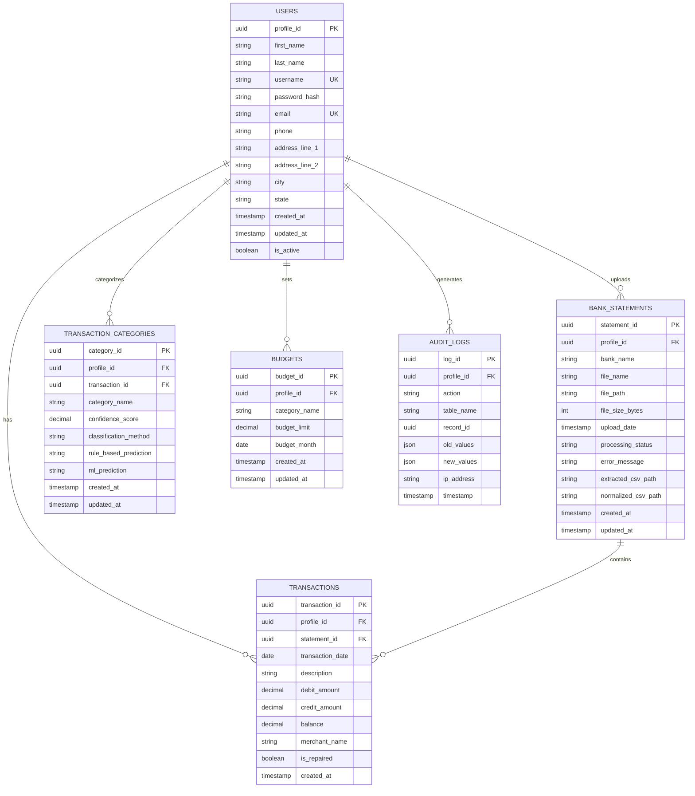
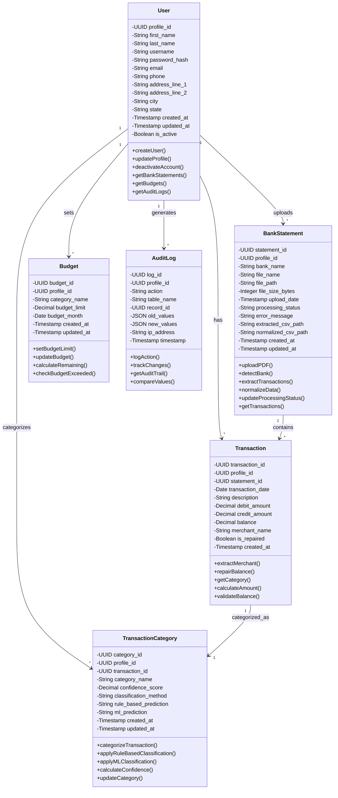

# ExpenseIQ - PostgreSQL Database Schema

## Table of Contents
1. [Overview](#overview)
2. [Table Definitions](#table-definitions)
3. [Entity Relationship Diagram](#entity-relationship-diagram)
4. [UML Class Diagram](#uml-class-diagram)
5. [Relationship Summary](#relationship-summary)
6. [Design Decisions](#design-decisions)

---

## Overview

ExpenseIQ uses PostgreSQL to store user data, bank statements, transactions, categorization results, budgets, and audit logs. All tables use UUID (GUID) as primary keys for distributed system compatibility.

---

## Table Definitions

### 1. **users** Table
Stores user account information with secure password handling.

```sql
CREATE TABLE public.users (
    profile_id UUID PRIMARY KEY DEFAULT gen_random_uuid(),

    first_name VARCHAR(100) NOT NULL,
    last_name VARCHAR(100) NOT NULL,

    username VARCHAR(50) UNIQUE NOT NULL,
    password_hash VARCHAR(255) NOT NULL,

    email VARCHAR(100) UNIQUE NOT NULL,
    phone VARCHAR(15),

    address_line_1 VARCHAR(255),
    address_line_2 VARCHAR(255),
    city VARCHAR(50),
    state VARCHAR(50),

    created_at TIMESTAMP DEFAULT CURRENT_TIMESTAMP,
    updated_at TIMESTAMP DEFAULT CURRENT_TIMESTAMP,

    is_active BOOLEAN DEFAULT TRUE
);

```

**Fields:**
| Field | Type | Constraints | Description |
|-------|------|-----------|-------------|
| profile_id | UUID | PK, DEFAULT gen_random_uuid() | Unique user identifier (GUID format) |
| first_name | VARCHAR(100) | NOT NULL | User's first name |
| last_name | VARCHAR(100) | NOT NULL | User's last name |
| username | VARCHAR(50) | UNIQUE, NOT NULL | Unique login username |
| password_hash | VARCHAR(255) | NOT NULL | Bcrypt hashed password |
| email | VARCHAR(100) | UNIQUE, NOT NULL | User's email address |
| phone | VARCHAR(15) | NULLABLE | User's phone number |
| address_line_1 | VARCHAR(255) | NULLABLE | Primary address |
| address_line_2 | VARCHAR(255) | NULLABLE | Secondary address |
| city | VARCHAR(50) | NULLABLE | City of residence |
| state | VARCHAR(50) | NULLABLE | State of residence |
| created_at | TIMESTAMP | DEFAULT CURRENT_TIMESTAMP | Account creation timestamp |
| updated_at | TIMESTAMP | DEFAULT CURRENT_TIMESTAMP | Last profile update |
| is_active | BOOLEAN | DEFAULT TRUE | Soft delete flag |

---

### 2. **bank_statements** Table
Stores PDF metadata and processing status.

```sql
CREATE TABLE public.bank_statements (
    statement_id UUID PRIMARY KEY DEFAULT gen_random_uuid(),

    profile_id UUID NOT NULL,
    bank_name VARCHAR(50) NOT NULL,

    file_name VARCHAR(255) NOT NULL,
    file_path VARCHAR(500),
    file_size_bytes INTEGER,

    upload_date TIMESTAMP DEFAULT CURRENT_TIMESTAMP,

    processing_status VARCHAR(20) DEFAULT 'PENDING',
    error_message TEXT,

    extracted_csv_path VARCHAR(500),
    normalized_csv_path VARCHAR(500),

    created_at TIMESTAMP DEFAULT CURRENT_TIMESTAMP,
    updated_at TIMESTAMP DEFAULT CURRENT_TIMESTAMP,

    CONSTRAINT fk_bankstatements_user
        FOREIGN KEY (profile_id)
        REFERENCES users(profile_id)
        ON DELETE CASCADE,

    CONSTRAINT chk_processing_status
        CHECK (processing_status IN (
            'PENDING',
            'PROCESSING',
            'COMPLETED',
            'FAILED',
            'VERIFIED'
        ))
);
```

**Indexes:**

CREATE INDEX idx_bank_statements_profile
ON public.bank_statements(profile_id);

**Fields:**
| Field | Type | Constraints | Description |
|-------|------|-----------|-------------|
| statement_id | UUID | PK, DEFAULT gen_random_uuid() | Unique statement identifier |
| profile_id | UUID | FK, NOT NULL, CASCADE | References users table |
| bank_name | VARCHAR(50) | NOT NULL | Bank name (SBI, HDFC, ICICI, KOTAK) |
| file_name | VARCHAR(255) | NOT NULL | Original PDF filename |
| file_path | VARCHAR(500) | NULLABLE | Path to uploaded PDF |
| file_size_bytes | INTEGER | NULLABLE | PDF file size in bytes |
| upload_date | TIMESTAMP | DEFAULT CURRENT_TIMESTAMP | When PDF was uploaded |
| processing_status | VARCHAR(20) | CHECK constraint | PENDING, PROCESSING, COMPLETED, FAILED, VERIFIED |
| error_message | TEXT | NULLABLE | Error details if processing failed |
| extracted_csv_path | VARCHAR(500) | NULLABLE | Path to extracted CSV file |
| normalized_csv_path | VARCHAR(500) | NULLABLE | Path to normalized CSV file |
| created_at | TIMESTAMP | DEFAULT CURRENT_TIMESTAMP | Record creation timestamp |
| updated_at | TIMESTAMP | DEFAULT CURRENT_TIMESTAMP | Last update timestamp |

---

### 3. **transactions** Table
Stores extracted transaction data from CSV.

```sql
CREATE TABLE public.transactions (
    transaction_id UUID PRIMARY KEY DEFAULT gen_random_uuid(),

    profile_id UUID NOT NULL,
    statement_id UUID NOT NULL,

    transaction_date DATE NOT NULL,
    description TEXT NOT NULL,

    debit_amount NUMERIC(12, 2),
    credit_amount NUMERIC(12, 2),
    balance NUMERIC(12, 2),

    merchant_name VARCHAR(255),
    is_repaired BOOLEAN DEFAULT FALSE,

    created_at TIMESTAMP DEFAULT CURRENT_TIMESTAMP,

    CONSTRAINT fk_transactions_user
        FOREIGN KEY (profile_id)
        REFERENCES users(profile_id)
        ON DELETE CASCADE,

    CONSTRAINT fk_transactions_statement
        FOREIGN KEY (statement_id)
        REFERENCES bank_statements(statement_id)
        ON DELETE CASCADE,

    CONSTRAINT chk_debit_credit
        CHECK (
            (debit_amount IS NOT NULL AND credit_amount IS NULL)
            OR
            (credit_amount IS NOT NULL AND debit_amount IS NULL)
            OR
            (debit_amount IS NULL AND credit_amount IS NULL)
        )
);

```

**Fields:**
| Field | Type | Constraints | Description |
|-------|------|-----------|-------------|
| transaction_id | UUID | PK, DEFAULT gen_random_uuid() | Unique transaction identifier |
| profile_id | UUID | FK, NOT NULL, CASCADE | References users table |
| statement_id | UUID | FK, NOT NULL, CASCADE | References bank_statements table |
| transaction_date | DATE | NOT NULL | Date of transaction |
| description | TEXT | NOT NULL | Transaction description/memo |
| debit_amount | NUMERIC(12, 2) | NULLABLE | Amount debited (withdrawal) |
| credit_amount | NUMERIC(12, 2) | NULLABLE | Amount credited (deposit) |
| balance | NUMERIC(12, 2) | NULLABLE | Account balance after transaction |
| merchant_name | VARCHAR(255) | NULLABLE | Extracted merchant/payee name |
| is_repaired | BOOLEAN | DEFAULT FALSE | Flag for balance-inference repairs |
| created_at | TIMESTAMP | DEFAULT CURRENT_TIMESTAMP | Record creation timestamp |

**Indexes:**

CREATE INDEX idx_transactions_profile_date
ON public.transactions(profile_id, transaction_date);

CREATE INDEX idx_transactions_statement
ON public.transactions(statement_id);

- `idx_profile_date`: Optimizes dashboard queries by user and date range
- `idx_statement_id`: Optimizes queries filtering by statement

---

### 4. **transaction_categories** Table
Stores categorization results with ML/rule-based confidence.

```sql
CREATE TABLE public.transaction_categories (
    category_id UUID PRIMARY KEY DEFAULT gen_random_uuid(),

    profile_id UUID NOT NULL,
    transaction_id UUID NOT NULL,

    category_name VARCHAR(50) NOT NULL,
    confidence_score NUMERIC(3, 2)
        CHECK (confidence_score >= 0 AND confidence_score <= 1),

    classification_method VARCHAR(20) NOT NULL,
    rule_based_prediction VARCHAR(50),
    ml_prediction VARCHAR(50),

    created_at TIMESTAMP DEFAULT CURRENT_TIMESTAMP,
    updated_at TIMESTAMP DEFAULT CURRENT_TIMESTAMP,

    CONSTRAINT fk_category_user
        FOREIGN KEY (profile_id)
        REFERENCES users(profile_id)
        ON DELETE CASCADE,

    CONSTRAINT fk_category_transaction
        FOREIGN KEY (transaction_id)
        REFERENCES transactions(transaction_id)
        ON DELETE CASCADE,

    CONSTRAINT uq_transaction_category
        UNIQUE (transaction_id),

    CONSTRAINT chk_classification_method
        CHECK (classification_method IN ('RULE_BASED', 'ML', 'HYBRID'))
);
```

**Fields:**
| Field | Type | Constraints | Description |
|-------|------|-----------|-------------|
| category_id | UUID | PK, DEFAULT gen_random_uuid() | Unique category assignment ID |
| profile_id | UUID | FK, NOT NULL, CASCADE | References users table |
| transaction_id | UUID | FK, NOT NULL, CASCADE | References transactions table |
| category_name | VARCHAR(50) | NOT NULL | Category (Food, Shopping, Travel, etc.) |
| confidence_score | NUMERIC(3, 2) | CHECK 0-1 | Confidence score (0.00-1.00) |
| classification_method | VARCHAR(20) | CHECK constraint | RULE_BASED, ML, or HYBRID |
| rule_based_prediction | VARCHAR(50) | NULLABLE | Rule-based category prediction |
| ml_prediction | VARCHAR(50) | NULLABLE | ML model category prediction |
| created_at | TIMESTAMP | DEFAULT CURRENT_TIMESTAMP | Record creation timestamp |
| updated_at | TIMESTAMP | DEFAULT CURRENT_TIMESTAMP | Last update timestamp |

**Indexes:**
CREATE INDEX idx_transaction_categories_profile
ON public.transaction_categories(profile_id);

CREATE INDEX idx_transaction_categories_category
ON public.transaction_categories(category_name);

- `idx_profile_category`: Optimizes category-wise spending queries

---

### 5. **budgets** Table
Stores user budget settings per category and month.

```sql
CREATE TABLE public.budgets (
    budget_id UUID PRIMARY KEY DEFAULT gen_random_uuid(),

    profile_id UUID NOT NULL,
    category_name VARCHAR(50) NOT NULL,

    budget_limit NUMERIC(12, 2) NOT NULL
        CHECK (budget_limit > 0),

    budget_month DATE NOT NULL,

    created_at TIMESTAMP DEFAULT CURRENT_TIMESTAMP,
    updated_at TIMESTAMP DEFAULT CURRENT_TIMESTAMP,

    CONSTRAINT fk_budgets_user
        FOREIGN KEY (profile_id)
        REFERENCES users(profile_id)
        ON DELETE CASCADE,

    CONSTRAINT uq_budget_unique
        UNIQUE (profile_id, category_name, budget_month)
);
```

**Fields:**
| Field | Type | Constraints | Description |
|-------|------|-----------|-------------|
| budget_id | UUID | PK, DEFAULT gen_random_uuid() | Unique budget identifier |
| profile_id | UUID | FK, NOT NULL, CASCADE | References users table |
| category_name | VARCHAR(50) | NOT NULL | Budget category |
| budget_limit | NUMERIC(12, 2) | NOT NULL, CHECK > 0 | Budget limit amount in ₹ |
| budget_month | DATE | NOT NULL | Month for budget (first day of month) |
| created_at | TIMESTAMP | DEFAULT CURRENT_TIMESTAMP | Record creation timestamp |
| updated_at | TIMESTAMP | DEFAULT CURRENT_TIMESTAMP | Last update timestamp |

**Constraints:**
- UNIQUE(profile_id, category_name, budget_month): Prevents duplicate budgets per category/month

**Indexes:**
CREATE INDEX idx_budgets_profile_month
ON public.budgets(profile_id, budget_month);

- `idx_profile_month`: Optimizes budget queries by user and month

---

### 6. **audit_logs** Table
Tracks all data modifications for compliance and debugging.

```sql
CREATE TABLE public.audit_logs (
    log_id UUID PRIMARY KEY DEFAULT gen_random_uuid(),

    profile_id UUID NOT NULL,

    action VARCHAR(50) NOT NULL,
    table_name VARCHAR(50) NOT NULL,
    record_id UUID,

    old_values JSONB,
    new_values JSONB,

    ip_address INET,

    timestamp TIMESTAMP DEFAULT CURRENT_TIMESTAMP,

    CONSTRAINT fk_auditlogs_user
        FOREIGN KEY (profile_id)
        REFERENCES users(profile_id)
        ON DELETE CASCADE,

    CONSTRAINT chk_audit_action
        CHECK (action IN (
            'INSERT',
            'UPDATE',
            'DELETE',
            'UPLOAD',
            'PROCESS'
        ))
);
```

**Fields:**
| Field | Type | Constraints | Description |
|-------|------|-----------|-------------|
| log_id | UUID | PK, DEFAULT gen_random_uuid() | Unique audit log identifier |
| profile_id | UUID | FK, NOT NULL, CASCADE | References users table |
| action | VARCHAR(50) | CHECK constraint | INSERT, UPDATE, DELETE, UPLOAD, PROCESS |
| table_name | VARCHAR(50) | NOT NULL | Table affected by action |
| record_id | UUID | NULLABLE | ID of affected record |
| old_values | JSONB | NULLABLE | Previous values before change |
| new_values | JSONB | NULLABLE | New values after change |
| ip_address | INET | NULLABLE | IP address of user performing action |
| timestamp | TIMESTAMP | DEFAULT CURRENT_TIMESTAMP | When action occurred |

**Indexes:**
CREATE INDEX idx_audit_logs_profile_time ON public.audit_logs(profile_id, timestamp);
- `idx_profile_timestamp`: Optimizes audit trail queries by user and time

---

## Entity Relationship Diagram



---

## UML Class Diagram



---

## Relationship Summary

| From | To | Cardinality | Type | Description |
|------|----|----|------|-------------|
| User | BankStatement | 1:N | One-to-Many | User uploads multiple bank statements |
| User | Transaction | 1:N | One-to-Many | User has multiple transactions (via statements) |
| User | TransactionCategory | 1:N | One-to-Many | User has categorized transactions |
| User | Budget | 1:N | One-to-Many | User sets budgets for multiple categories |
| User | AuditLog | 1:N | One-to-Many | All user actions are logged |
| BankStatement | Transaction | 1:N | One-to-Many | Each statement contains multiple transactions |
| Transaction | TransactionCategory | 1:1 | One-to-One | Each transaction has one category |

---

## Design Decisions

| Aspect | Decision | Rationale |
|--------|----------|-----------|
| **Primary Keys** | UUID (GUID) | Distributed system friendly, privacy-preserving, no sequential guessing |
| **Currency Fields** | NUMERIC(12, 2) | Prevents floating-point precision errors in financial calculations |
| **CSV Storage** | File paths in DB | Reduces database bloat; CSVs stored on disk/S3 for scalability |
| **Confidence Scores** | NUMERIC(3, 2) | Enforces 0.00-1.00 range at database level |
| **Timestamps** | TIMESTAMP | Tracks all modifications for auditing and compliance |
| **Indexes** | profile_id + date/category | Optimizes dashboard and analytics queries |
| **Constraints** | CHECK & UNIQUE | Data integrity enforced at database level |
| **Soft Deletes** | is_active flag | Preserves historical data for audit trails |
| **Cascade Delete** | ON DELETE CASCADE | Maintains referential integrity when users are deleted |
| **JSONB for Audit** | JSONB columns | Flexible schema for storing before/after values |

---

## Migration Strategy (Alembic)

Initialize and manage schema versions:

```bash
alembic init migrations
alembic revision --autogenerate -m "Initial schema"
alembic upgrade head
```

This ensures reproducible deployments across development, staging, and production environments.

---

## Performance Optimization Tips

1. **Partitioning:** Consider partitioning `transactions` table by `profile_id` for large datasets
2. **Archiving:** Archive old statements and transactions to separate tables after 2 years
3. **Materialized Views:** Create materialized views for dashboard aggregations
4. **Connection Pooling:** Use PgBouncer for connection management in production
5. **Backup Strategy:** Implement daily backups with AWS RDS automated backups

---

## Security Considerations

- All passwords stored as bcrypt hashes (never plain text)
- Sensitive data (API keys, tokens) stored in AWS Secrets Manager
- Audit logs track all modifications for compliance
- IP address logging for security monitoring
- JSONB audit values should exclude sensitive fields
- Use row-level security (RLS) for multi-tenant isolation if needed
